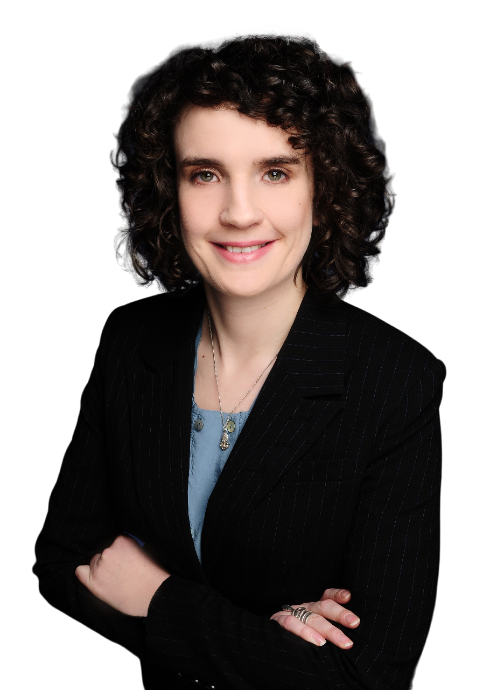

# About me

**pragmatic ★ goal- and solution-oriented ★ responsible**

{: .bild}

Born in the Frankfurt area, but a citizen of the world at
heart. Intrinsically motivated to make our lives safer, more
environmentally friendly and healthier. Convinced that processes in
companies and authorities can be made easier with my support and that
managers and employees can live active environmental protection and
occupational safety without a heavy burden.

Many years of professional experience as an internal safety
coordinator and environmental manager in industry and administration.
Active in the following sectors, including: electronics
manufacturing, energy and water supply, paper and pulp industry,
publishing and services.

## Titles and certificates

- M.A. Sustainability Economics and Management
- B.A. Environmental Economics and Business Management
- Training as occupational safety and health specialist (acquisition of safety-related expertise in accordance with DGUV regulation 2) (BG ETEM, sector specifities energy and water supply and manufacturing)
- Environmental management specialist (UMF-TÜV), environmental management
representative (UMB-TÜV), environmental management auditor (UMA-TÜV)
and environmental auditor (UBP-TÜV),
- Energy Management Representative and Internal Auditor ISO 50001 (DEKRA)
- Various further training courses to maintain expertise and knowledge level

